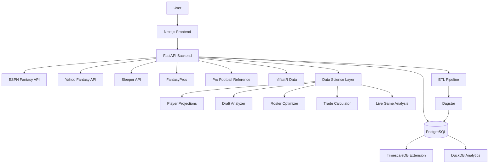
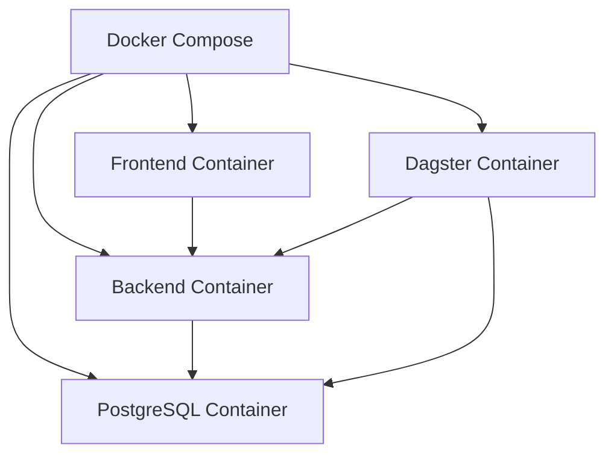

# UPFFM Architecture

This document outlines the high-level architecture of the Ultimate Personal Fantasy Football Manager application.

## System Overview

## Component Details

### Frontend

- **Technology**: Next.js (React 18)
- **UI Components**: shadcn/ui
- **State Management**: React Context and SWR for data fetching
- **Features**:
  - Responsive design
  - Dark mode support
  - PWA capabilities for mobile use

### Backend API

- **Technology**: FastAPI on Python 3.11+
- **Authentication**: JWT-based authentication
- **Key Endpoints**:
  - League management
  - Player data
  - Projections
  - Draft tools
  - Roster optimization
  - Trade analysis

### Data Storage

- **Primary Database**: PostgreSQL with TimescaleDB extension
- **Analytics Engine**: DuckDB/Polars for high-performance queries
- **Key Tables**:
  - Players
  - Teams
  - Leagues
  - Projections
  - Historical stats
  - Draft data

### ETL Pipeline

- **Orchestration**: Dagster
- **Data Sources**:
  - ESPN Fantasy API
  - Yahoo Fantasy API
  - Sleeper API
  - FantasyPros
  - Pro Football Reference
  - nflfastR data
- **Schedules**:
  - Daily player updates
  - Hourly league syncs during game days
  - Weekly projection updates

### Analytics Layer

- **Libraries**: pandas/Polars, scikit-learn, XGBoost, LightGBM
- **Key Models**:
  - Player projections
  - Value-based drafting metrics
  - Lineup optimization
  - Trade fairness evaluation
  - Win probability predictions

## Deployment Architecture

The application is deployed as a set of Docker containers, making it easy to run locally or deploy to a cloud environment.

